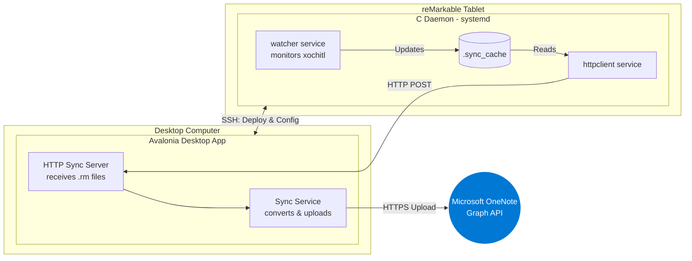

# Contributing to reMarkable OneNote Sync

First off, thank you for considering contributing to `rmOneNoteSync`! Whether you are fixing a bug, adding a feature, or improving documentation, your help is greatly appreciated. This guide is written to help you get oriented quickly, even if this is your very first open-source contribution.

---

## Table of Contents
- [Getting Started](#-getting-started)
- [System Architecture Overview](#-system-architecture-overview)
- [Part 1: The Desktop Application](#part-1-the-desktop-application-apprmonenotesyncapp)
- [Part 2: The Device Daemon](#part-2-the-device-daemon-rm-daemon)
- [How Everything Connects: The Data Flow](#-how-everything-connects-the-data-flow)
- [Repository Structure](#-repository-structure)
- [Development Setup](#-development-setup)
- [CI/CD Pipeline](#-cicd-pipeline)
- [Submitting a Contribution](#-submitting-a-contribution)

---

## 🚀 Getting Started

If you're new to open source, here's a quick overview of the workflow:

### 🤝 Pull Request Workflow

We follow a standard, clean open-source workflow:

1. **Find or Open an Issue:** Before writing code, ensure there is an open Issue for your bug or feature. This prevents duplicated effort!
2. **Fork & Clone:** Fork the repository to your account and clone it locally.
3. **Branch:** Create a branch using a semantic naming convention (e.g., `git checkout -b fix/issue-42-button-color` or `feat/new-sync-ui`).
4. **Code & Test:** Make your changes. Ensure `dotnet build` and `make all` run cleanly.
5. **Push:** Push the branch to your fork.
6. **Open a PR:** Open a Pull Request against our `main` branch. 
   * **Crucial:** In your PR description, write `Fixes #ISSUE_NUMBER` so GitHub automatically links and closes the issue when merged.

Before you start coding, please read the architecture sections below. Understanding how the two halves of the project communicate is the key to working on this codebase effectively.

---

## 🏗️ System Architecture Overview

This project uses a **decoupled, two-part architecture**. This design is intentional: it minimizes the CPU and battery impact on the reMarkable tablet by offloading all heavy processing (authentication, format conversion, cloud API calls) to the user's desktop computer.



---

## Part 1: The Desktop Application (`app/rmOneNoteSyncApp`)

**Language & Framework:** C# 13, .NET 9, [Avalonia UI](https://avaloniaui.net/) (cross-platform UI framework).
**Pattern:** MVVM (Model-View-ViewModel) using [CommunityToolkit.Mvvm](https://learn.microsoft.com/en-us/dotnet/communitytoolkit/mvvm/).

The desktop app is the "brain" of the operation. It handles everything the tablet cannot or should not do: user authentication, database management, file format conversion, and communicating with the Microsoft Graph API.

### Dependency Injection

All services and ViewModels are registered as **singletons** in `Program.cs` using `Microsoft.Extensions.Hosting`. This means you can access any service from anywhere by injecting it through a constructor. Platform-specific services (like device detection) are registered conditionally based on the OS.

### Models (`Models/`)

These are simple C# data classes (POCOs) that define the shape of the data used throughout the application.

| File | Purpose |
|---|---|
| `SyncConfiguration.cs` | Stores all user-configurable settings: device IP, password, sync interval, OneNote tokens, cache retention, etc. This is the single source of truth for app configuration, persisted in SQLite. |
| `DeviceInfo.cs` | Represents a connected reMarkable device. Contains the IP, MAC address, connection type (USB/WiFi), and a model codename mapper (e.g., `"ferrari"` → `"reMarkable Paper Pro"`). Also defines the `ConnectionState` enum used across the UI (`Disconnected`, `Detected`, `Authenticating`, `Connected`, `Configured`, `Error`). |
| `PageMetadata.cs` | Tracks the state of each individual notebook page through its sync lifecycle (`Pending` → `InProgress` → `Uploaded`/`Failed`/`Skipped`). Contains links to local `.rm` files, converted output paths, OneNote page URLs, and retry counts. Also defines `DocumentMetadata`, which groups pages and maps them to OneNote notebook names via virtual path parsing. |

### Services (`Services/`)

This is the heaviest part of the codebase. Each service is an implementation of an interface defined in `Services/Interfaces/`, which makes them mockable and testable.

#### Core Services

| Service | Interface | Responsibility |
|---|---|---|
| `SshService` | `ISshService` | All communication with the tablet goes through here. Uses [SSH.NET](https://github.com/sshnet/SSH.NET) for connecting, executing shell commands, and transferring files via SFTP. Exposes an `OnConnectionChanged` event consumed by the UI. |
| `SqliteDatabaseService` | `IDatabaseService` | Manages the local SQLite database (`sync.db`). Stores `SyncConfiguration`, `PageMetadata`, `DocumentMetadata`, sync history, and generic telemetry key-value pairs. Uses [Dapper](https://github.com/DapperLib/Dapper) as its micro-ORM. |
| `SyncService` | `ISyncService` | The main orchestrator. When a sync is triggered (manually or on timer), it fetches all `Pending` pages from the database, converts each `.rm` file to InkML via `RmConverterService`, then creates/finds the correct Notebook → Section hierarchy on OneNote and uploads the page using `OneNoteClient`. Fires progress and completion events consumed by `SyncStatusViewModel`. |
| `SyncServerService` | `ISyncServerService` | Runs a local **HTTP server** (using `HttpListener`) on port 8080. This is the endpoint the tablet's `httpclient` daemon POSTs `.rm` files to. It validates API keys, checks the document whitelist, saves files to disk, records metadata in the database, and raises a `FileReceived` event that triggers `SyncService`. |
| `SyncServerHostedService` | (IHostedService) | A thin wrapper that starts and stops `SyncServerService` as a .NET background hosted service, so the HTTP server runs for the lifetime of the application. |
| `DeploymentService` | `IDeploymentService` | Handles the full lifecycle of installing, updating, and uninstalling the C daemon on the tablet. It downloads the correct pre-compiled binaries from GitHub Releases (matching the device model), uploads them via SSH, writes config files, installs systemd service units, and starts the services. |
| `OneNoteAuthService` | `IOneNoteAuthService` | Manages Microsoft Account authentication using [MSAL](https://learn.microsoft.com/en-us/entra/msal/). Handles interactive sign-in, silent token refresh, and sign-out. Persists the token cache to disk (`msalcache.bin`). |
| `OneNoteClient` | `IOneNoteClient` | Wraps the [Microsoft Graph SDK](https://learn.microsoft.com/en-us/graph/sdks/sdks-overview) for all OneNote operations: listing/creating notebooks and sections, uploading InkML+HTML pages as multipart payloads, and managing page lifecycle. |
| `ConfigurationProviderService` | `IConfigurationProviderService` | Generates and pushes `httpclient.conf` to the tablet over SSH. This is how the desktop app tells the daemon where to send files (IP, port, API key), what documents to sync (the whitelist), and timing parameters. |
| `RmConverterService` | `IRmConverterService` | Shells out to the `rmc` external tool to convert reMarkable's proprietary `.rm` ink format into InkML (`.xml`) and a presentation HTML file (`.html`). |
| `StartupService` | `IStartupService` | Manages OS-level auto-start registration (e.g., adding a `.desktop` file to `~/.config/autostart` on Linux). |
| `SoftwareUpdateService` | `ISoftwareUpdateService` | Checks the GitHub Releases API for newer versions of the application. |

#### Platform-Specific Services (`Services/Platform/`)

Device detection (finding the reMarkable on the network) is OS-specific:

| File | Platform | Strategy |
|---|---|---|
| `DeviceDetectionServiceBase.cs` | Shared | Contains the common detection logic: first check USB (`10.11.99.1`), then try a cached IP, then run an ARP scan with limited retries, and finally offer a manual scan button. Implements a 30-second grace period for temporary disconnections. |
| `WindowsDeviceDetectionService.cs` | Windows | Uses WMI/`System.Management` for ARP table queries. |
| `LinuxDeviceDetectionService.cs` | Linux | Parses `/proc/net/arp` and uses `ip neigh`. |
| `MacOSDeviceDetectionService.cs` | macOS | Shells out to `arp -a`. |
| `GenericDeviceDetectionService.cs` | Fallback | Uses [SharpPcap](https://github.com/dotpcap/sharppcap) for generic packet capture based detection. |

### ViewModels (`ViewModels/`)

ViewModels are the glue between Services and Views. They use `[ObservableProperty]` and `[RelayCommand]` source generators from CommunityToolkit.Mvvm to expose reactive properties and commands to the XAML views.

| File | Responsibility |
|---|---|
| `MainViewModel` | The root ViewModel. Manages navigation between all views, coordinates the full device connection flow (detect → authenticate → deploy → configure), and controls whether the Setup screen or the main Dashboard is shown. |
| `DashboardViewModel` | Populates the Dashboard: recently synced notebooks, recent activity log, last-connected timestamp, and clickable notebook links to OneNote. |
| `FolderPickerViewModel` | Lets the user browse the tablet's filesystem over SSH and select which folders/notebooks to sync. Selected document IDs are saved to `SyncConfiguration.SyncFiles` and also pushed to the daemon's whitelist. |
| `SyncStatusViewModel` | Displays real-time sync progress by subscribing to `SyncService` events. Shows per-page status, step counts, and overall progress bars. |
| `SettingsViewModel` | Exposes all user-configurable settings, device management actions (disconnect, clear cache, restart services), and OneNote sign-in/sign-out. |
| `LogsViewModel` | Fetches and displays logs from both the local app (Serilog files) and the remote device (journalctl over SSH), sorted by source and timestamp. |
| `ConfirmDialogViewModel` | A simple confirmation dialog (OK/Cancel) used before destructive actions. |
| `ViewModelBase` | Base class for all ViewModels. Extends `ObservableObject`. |

### Views (`Views/`)

Avalonia XAML files for rendering the UI. Each `View` is bound to its corresponding `ViewModel` via `DataContext`. The root window is `MainWindow.axaml`, which hosts a navigation sidebar and swaps the content area between views.

---

## Part 2: The Device Daemon (`rm-daemon`)

**Language:** C (C99).
**Build System:** GNU Make with cross-compilation via the [reMarkable Codex toolchain](https://developer.remarkable.com/).

The daemon is designed to be as lightweight as possible. It runs silently on the tablet and has two responsibilities: detecting document changes and sending modified pages to the desktop app.

### Source Files (`src/`)

#### `watcher.c` — The Filesystem Watcher Service

This is the first of two `systemd` services (`onenote-sync-watcher`). Its job is to watch for notebook changes and queue modified pages for upload.

**How it works:**
1. Reads paths and whitelist configuration from `watcher.conf`.
2. Opens the xochitl documents directory using Linux's [inotify](https://man7.org/linux/man-pages/man7/inotify.7.html) API (`inotify_init`, `inotify_add_watch`).
3. Enters an infinite event loop, watching for `IN_CREATE`, `IN_MODIFY`, `IN_DELETE`, and `IN_MOVED_TO` events.
4. When a `.metadata` file changes, it parses the JSON to extract `lastModified` and `lastOpened` timestamps. If the document was modified after it was last opened (meaning the user made edits), it scans all `.rm` pages in that document's subdirectory.
5. For each modified page, it checks the shared **binary cache** (`.sync_cache`). If the page is new or has a newer `mtime`, it's added to the cache queue.
6. Filters all events against a configurable **whitelist** of document UUIDs. Only explicitly selected notebooks are processed.

#### `httpclient.c` — The HTTP Upload Service

This is the second `systemd` service (`onenote-sync-httpclient`). It reads the cache queue and uploads files to the desktop app.

**How it works:**
1. Reads configuration from `httpclient.conf` (server URL, API key, upload interval, retry settings).
2. Enters a polling loop (default: every 30 seconds).
3. Each cycle, it reloads the shared cache, grabs up to 10 pending pages, and attempts to upload each one.
4. For each page, it reconstructs the full virtual path (e.g., `Academy/Physics/Calculus/Page 3`) using `metadata_parser`, then sends the `.rm` file via HTTP POST to the desktop app's sync server.
5. The HTTP request includes custom headers (`X-API-Key`, `X-Document-Path`, `X-Document-Id`, `X-Filename`) that the desktop server uses to organize and identify the file.
6. If the primary server URL fails, it retries with a configurable **fallback URL** (useful when the tablet can reach the desktop over either USB or WiFi).
7. Successfully uploaded pages are removed from the cache queue.

#### `cache_io.c` / `cache_io.h` — The Shared Binary Cache

This is the IPC mechanism between the watcher and httpclient. It's a custom binary file format (`.sync_cache`) backed by a hash table of documents, each containing a linked list of pages.

Key structures:
- **`PageEntry`**: UUID, page number, modification time, linked list pointer.
- **`DocumentEntry`**: Document UUID, linked list of pages, hash table chaining pointer.
- **`CacheHandle`**: The hash table itself, a dirty flag, and the file path.

The cache operates as a **FIFO queue**: the watcher pushes entries in, and the httpclient pops them out after successful upload. Both processes call `cache_reload()` before reading to stay in sync with the on-disk state.

#### `metadata_parser.c` / `metadata_parser.h` — Virtual Path Reconstruction

Reconstructs human-readable folder paths from reMarkable's flat UUID-based filesystem. Each document on the tablet has a `.metadata` JSON file containing a `parent` UUID pointing to its containing folder. This module walks the parent chain to build paths like `Shared Vault/Physics/Calculus Notes`.

Also parses `.content` files to extract page numbers (the `"idx"` field), mapping page UUIDs to their user-visible page numbers.

#### `http_simple.c` / `http_simple.h` — Lightweight HTTP Client

A minimal, dependency-free HTTP client built on raw POSIX sockets. Only supports what the project needs:
- `http_get()` — For fetching configuration from the desktop server.
- `http_post_file()` — For uploading `.rm` files as `application/octet-stream` with custom headers.
- No external dependencies (no libcurl) to keep the binary small and easy to cross-compile.

### Configuration (`config/`)

| File | Purpose |
|---|---|
| `watcher.conf` | Paths for the watch directory, log file, and shared cache. The desktop app also injects whitelist entries here. |
| `httpclient.conf` | Server URL, fallback URL, API key, upload interval, retry limits, and timeout. Generated and pushed by `ConfigurationProviderService`. |
| `onenote-sync-watcher.service` | systemd unit file for the watcher daemon. Starts after `home.mount`, restarts on failure. |
| `onenote-sync-httpclient.service` | systemd unit file for the httpclient daemon. Starts after network is available, wants the watcher service to be running. |

### Testing Tools (`testing_tools/`)

| File | Purpose |
|---|---|
| `cache_debug.c` | A standalone CLI tool that reads and dumps the `.sync_cache` file contents for debugging. Shows document IDs, page UUIDs, virtual paths, and filenames. |
| `test_server.py` | A Python mock of the desktop HTTP server for local testing without the full .NET app running. |
| `watcher_profiler.sh` | A shell script for profiling the watcher's CPU and memory usage on the device. |

---

## 🔄 How Everything Connects: The Data Flow

Here's the complete journey of a notebook page from pen stroke to OneNote:

```
 User edits           inotify event           Cache write           HTTP POST
 a notebook    ───►   watcher.c detects  ───► .sync_cache  ───►    httpclient.c
 on tablet            .metadata change         (binary FIFO)        sends .rm file
                                                                         │ 
                                                                         ▼
                                                              Desktop HTTP Server
                                                              (SyncServerService)
                                                                         │
                                                                         ▼
                                                              Save .rm to disk
                                                              Record in SQLite
                                                                         │
                                                                         ▼
                                                              SyncService triggers
                                                                         │
                                                    ┌────────────────────┼────────────────────┐
                                                    ▼                    ▼                    ▼
                                              RmConverterService   OneNoteClient        Database
                                              (.rm → InkML + HTML) (Graph API upload)   (status update)
                                                                         │
                                                                         ▼
                                                                   Page appears
                                                                   in OneNote 🎉
```

---

## 📂 Repository Structure

```text
rmOneNoteSync/
├── .github/
│   ├── assets/                   # App icon, preview screenshots
│   ├── ISSUE_TEMPLATE/           # GitHub issue forms
│   └── workflows/
│       └── build.yml             # CI/CD pipeline (see below)
├── app/
│   └── rmOneNoteSyncApp/         # C# Avalonia Desktop Application
│       ├── Assets/               # Icons, .desktop files
│       ├── Converters/           # XAML value converters (bool, color, equality)
│       ├── Models/               # Data classes (SyncConfiguration, DeviceInfo, PageMetadata)
│       ├── Services/
│       │   ├── Interfaces/       # 12 service contracts (ISshService, ISyncService, etc.)
│       │   └── Platform/         # OS-specific device detection (Windows, Linux, macOS)
│       ├── ViewModels/           # UI logic (MainViewModel, DashboardViewModel, etc.)
│       ├── Views/                # Avalonia XAML UI definitions
│       ├── Program.cs            # Entry point, DI container setup, Serilog config
│       ├── App.axaml / App.axaml.cs   # Avalonia application root
│       └── rmOneNoteSyncApp.csproj    # Project file with all NuGet dependencies
├── rm-daemon/                    # Native C codebase for the tablet
│   ├── src/
│   │   ├── watcher.c             # inotify-based filesystem monitor
│   │   ├── httpclient.c          # Polling HTTP upload client
│   │   ├── cache_io.c / .h       # Shared binary cache (FIFO queue)
│   │   ├── metadata_parser.c / .h # Virtual path reconstruction from UUIDs
│   │   ├── http_simple.c / .h    # Dependency-free raw socket HTTP client
│   │   └── version.h             # Version stamp (injected by CI)
│   ├── config/                   # systemd units and .conf templates
│   ├── testing_tools/            # cache_debug, test_server.py, profiler
│   └── Makefile                  # Cross-compilation build rules
├── installer.iss                 # Inno Setup script for Windows installer
├── install.sh                    # Portable installation script for Linux
└── uninstall.sh                  # Portable removal script for Linux
```

---

## 🛠️ Development Setup

### Desktop Application

**Prerequisites:**
- [.NET 9 SDK](https://dotnet.microsoft.com/download/dotnet/9.0)
- An IDE with C# support (e.g., [JetBrains Rider](https://www.jetbrains.com/rider/), Visual Studio, or VS Code with the C# Dev Kit)

```bash
# Restore dependencies
cd app/rmOneNoteSyncApp
dotnet restore

# Run in development
dotnet run
```

> **Note:** To enable OneNote functionality, you need an Azure App Registration Client ID. Set it in `appsettings.json`. For local development without OneNote, the app will still run — the auth features will simply fail gracefully. Example `appsettings.json`:

```json
{
  "AzureAd": {
    "ClientId": "YOUR_COPIED_CLIENT_ID_HERE"
  }
}
```

### Device Daemon

**Prerequisites:**
- The [reMarkable Codex toolchain](https://developer.remarkable.com/) for your target device
- GNU Make

```bash
# Source the cross-compilation environment for your device
source /opt/codex/ferrari/4.3.98/environment-setup-cortexa53-crypto-remarkable-linux

# Build all binaries
cd rm-daemon
make all
```

This produces three binaries in `build/`: `watcher`, `httpclient`, and `cache_debug`.

> **Tip:** If you are only working on the desktop application, you do not need the Codex toolchain at all. The daemon binaries are pre-compiled and distributed via GitHub Releases. The desktop app downloads them automatically during deployment.

---

## 🔁 CI/CD Pipeline

The project uses **GitHub Actions** (`build.yml`) with four coordinated jobs:

| Job | Runner | What It Does |
|---|---|---|
| `build-core` | `ubuntu-latest` | Publishes the .NET app for Windows, Linux, and macOS (self-contained, single-file). Also builds `.deb` and `.rpm` packages for Linux. |
| `build-windows-installer` | `windows-latest` | Downloads the Windows portable artifact from `build-core` and packages it into an Inno Setup installer (`.exe`). |
| `build-rm-daemon` | `ubuntu-latest` (matrix) | Cross-compiles the C daemon for **all four** reMarkable device targets (`ferrari`, `chiappa`, `rm2`, `rm1`) using the official Codex toolchains. |
| `publish-release` | `ubuntu-latest` | Runs on tag pushes (`v*`). Collects all artifacts, packages them as `.zip`/`.tar.gz`, and publishes a GitHub Release. Tags containing `alpha` or `beta` are marked as pre-releases. |

Version numbers are injected from the Git tag into `rmOneNoteSyncApp.csproj`, `installer.iss`, and `version.h` during CI. The placeholder value `0.0.0-PLACEHOLDER` is replaced with the clean version string (e.g., `1.0.0`).

---

## ✅ Submitting a Contribution

1. Ensure your changes **build without errors**: `dotnet build` for the C# app, `make all` for the daemon.
2. If you've changed C code in the `rm-daemon`, test it locally with the `cache_debug` tool and monitor the logs.
3. Write clear, descriptive commit messages.
4. If your change is user-facing, update the relevant section of the `README.md`.
5. Open a PR with a description of **what** you changed and **why**.

### Areas Where Help Is Especially Welcome

- 🐛 **Bug fixes** — Check the [Issues tab](https://github.com/Excustic/rmOneNoteSync/issues) for open bugs.
- 🧪 **Testing on new platforms** — If you own a reMarkable device and can test the app on an "Untested" combination from the [Compatibility Matrix](README.md#-compatibility-matrix), please open a compatibility report!
- 📖 **Documentation** — Improved guides, screenshots, or translated documentation are always welcome.
- ✨ **Feature contributions** — Check for feature requests in the Issues tab, or propose your own.

---

Thank you for reading this far. Happy contributing! 🎉