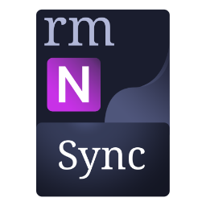

  
  
  # reMarkable OneNote Sync 

  
  

  *A lightweight, cross-platform desktop application and on-device daemon that seamlessly synchronizes your reMarkable notebooks directly to Microsoft OneNote.*

https://github.com/user-attachments/assets/81273bca-e51a-4322-a46f-470b707c90f3

## ❓ Motivation
As a student who uses a reMarkable device on a daily basis, whether being limited by the OS or just needing to pick from where I left off on a different device - I couldn't find an easy way to do so without manual intervention.
I could not see myself maunually uploading and downloading pdfs for every page, so of course... I decided to spend much more time on an automatic tool which transfers **complete ink data**, giving me control over every dot and letter on OneNote.
My end goal is to create as less friction as possible and make the workflow easy & quick to set up and run not requiring any extra care and attention.

## ✨ Features
* **Local First Server-Client Architecture:** A lightweight C daemon running quietly on your tablet, and a modern Avalonia C# dashboard for your PC. This is a well-balanced solution, as users would typically utilise the same machine for syncing as well as working on OneNote, relieving them from paying for cloud services. **Cloud sync is currently not suppored**.
* **Universal Compatibility:** See the [Compatibility Matrix](#-compatibility-matrix) below.
* **Built-in mapping logic:** Generally, once you upload any document/notebook of your choice, they will be automatically mapped as follows:
  - Parent folder (root as exception) -> OneNote Notebook. e.g. rm_Academy_Year I_Mathematics
  - Document/notebook of your choice -> A section in your OneNote notebook. e.g. Calculus I
  - Pages -> OneNote pages. e.g. Page 34
  
  This maintains a consistent document structure and prevents unnecessary creation of redundant notebooks.
* **Cross-Platform:** Native desktop clients for Windows, macOS, and Linux.
* **Background Sync:** Set it and forget it. Syncs automatically over Wi-Fi or USB, with a service running on your PC. Something didn't go through? Manually sync any pages of your choice.
* **Software and Firmware Updater:** Built-in update checker so you never miss a feature.

## 🚀 Installation
> [!Caution]
> **Experimental Software & Disclaimer**
> This software is currently in an **Alpha** state. While built with care, it creates and reads internal files on your reMarkable tablet. **For your peace of mind, it is advised that important notebooks are backed up to the reMarkable Cloud before using this tool.** The developers of this application, as well as reMarkable AS, are not responsible for any lost notebooks, corrupted files, or damage to your device. Use at your own risk.
Head over to the [Releases page](https://github.com/Excustic/rmOneNoteSync/releases/latest) to grab the latest version for your operating system.

### Windows
Download and run `rmOneNoteSyncApp-Setup.exe`. 

### Linux
The project provides native packages for major distributions, as well as a portable tarball for custom setups.
* **Debian/Ubuntu:** `sudo apt install ./rmOneNoteSync.deb`
* **Fedora/RedHat:** `sudo rpm -ivh --nodigest ./rmOneNoteSync.rpm`
* **Arch/Other:** Download the `.tar.gz`, extract it, and run `bash ./install.sh`.

### macOS
Download the macOS portable release, extract the folder, and run the executable.

## 📖 Usage
1. Complete the setup process in the application. [Developer mode](https://support.remarkable.com/s/article/Developer-mode) is required, or ["hacking"](https://support.remarkable.com/s/article/Developer-mode) the device for older versions.
2. Navigate to **Settings**, choose your preferences and ensure the services are running. **For seamless syncing experience - set sync interval to 10 seconds.** 
3. Navigate to **File Browser** and select the folders/notebooks you wish to sync.
4. Navigate to **Sync Status** and monitor the ongoing sync jobs.
5. Navigate to **Logs** to monitor the application's activity both on the device and on your PC.
6. Navigate to **Dashboard** to view your synchronized notebooks.

---

## 🧪 Compatibility Matrix

The project strives to support a wide range of hardware and operating systems and all reMarkable devices. Below is the current testing status of various combinations:

| Desktop OS | App Version | reMarkable Device | rM OS Version | Status |
| :--- | :--- | :--- | :--- | :--- |
| Windows 11 (x64) | v1.0.0-alpha.2 | reMarkable Paper Pro | v3.25.1.1 | ✅ Verified |
| Arch Linux (KDE Plasma) | v1.0.0-alpha.2 | reMarkable Paper Pro | v3.25.1.1 | ✅ Verified |
| Ubuntu 24.04 | v1.0.0-alpha | reMarkable Paper Pro | N/A | ❓ Untested |
| macOS 14 (Apple Silicon) | v1.0.0-alpha | reMarkable Paper Pro | N/A | ❓ Untested |
| Windows 11 (x64) | v1.0.0-alpha | reMarkable 2 | N/A | ❓ Untested |
| Arch Linux (KDE Plasma) | v1.0.0-alpha | reMarkable 2 | N/A | ❓ Untested |
| Ubuntu 24.04 | v1.0.0-alpha | reMarkable 2 | N/A | ❓ Untested |
| macOS 14 (Apple Silicon) | v1.0.0-alpha | reMarkable 2 | N/A | ❓ Untested |
| Windows 11 (x64) | v1.0.0-alpha | reMarkable 1 | N/A | ❓ Untested |
| Arch Linux (KDE Plasma) | v1.0.0-alpha | reMarkable 1 | N/A | ❓ Untested |
| Ubuntu 24.04 | v1.0.0-alpha | reMarkable 1 | N/A | ❓ Untested |
| macOS 14 (Apple Silicon) | v1.0.0-alpha | reMarkable 1 | N/A | ❓ Untested |
| Windows 11 (x64) | v1.0.0-alpha.2 | reMarkable Move | v3.26.0.68 | ✅ Verified |
| Arch Linux (KDE Plasma) | v1.0.0-alpha | reMarkable Move | N/A | ❓ Untested |
| Ubuntu 24.04 | v1.0.0-alpha | reMarkable Move | N/A | ❓ Untested |
| macOS 14 (Apple Silicon) | v1.0.0-alpha | reMarkable Move | N/A | ❓ Untested |

*(If you successfully run this app on an "Untested" combination, please let us know by opening a hardware report in the [Issues tab](https://github.com/Excustic/rmOneNoteSync/issues)!)*

---

## 🛠️ For Developers
Want to compile the app from source or contribute to the project? Please read our [Contributing Guidelines](CONTRIBUTING.md) for instructions on setting up your local environment and configuring the Azure Microsoft Graph API credentials.
